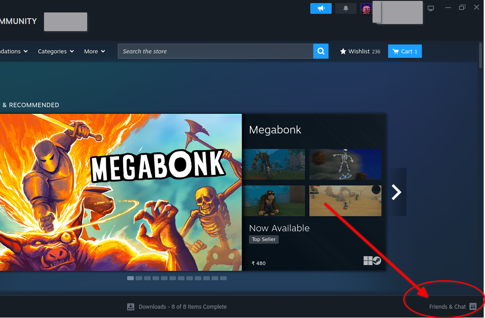
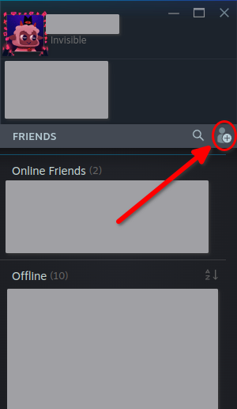
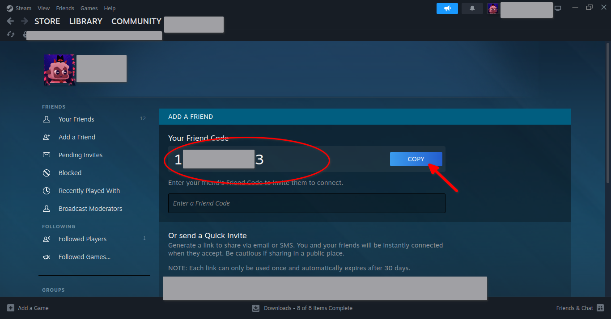
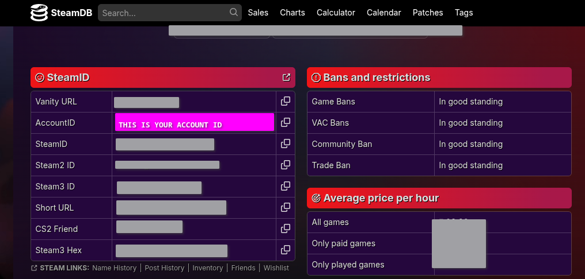
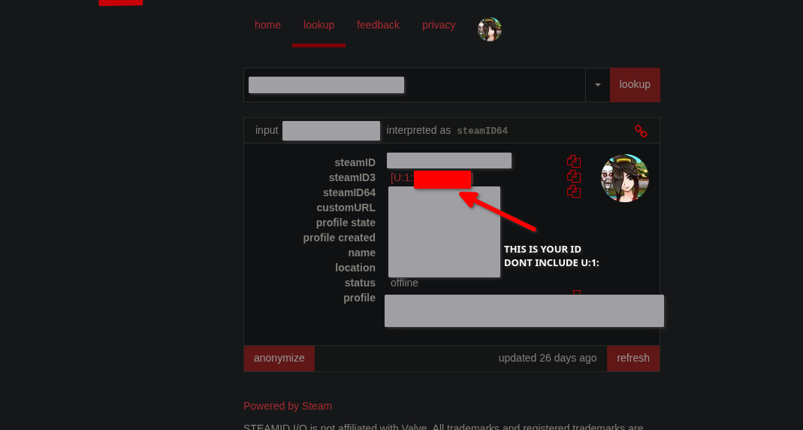

# Steam Schema Generator

This tool allows you to generate `UserGameStatsSchema` and `UserGameStats` files for Steam games using the Steam Web API.

## Features

*   **Interactive UI:** A simple and easy-to-use terminal interface.
*   **Multiple Game Sources:** Generate schemas from your `SLSsteam` config, by scanning your Steam library, or by manual App ID input.
*   **API Key & User ID Management:** Securely saves your Steam API key and User ID so you only have to enter them once.
*   **Smart File Handling:** Intelligently handles existing files with options to overwrite, update (merge new achievements), or skip.
*   **Game Name Display:** Shows the name of the game being processed.
*   **Summary Report:** Provides a summary of the operations performed.

## Configuration

During the first run, the script will prompt you for your Steam Web API Key and your Steam User ID. These are saved in a local `.env` file in the script's directory, so you only need to enter them once.

### Steam Web API Key

**Important:** You can use an API key from any Steam account. It does not need to be from your primary account. This key is only used to fetch public achievement data and is not linked to your account for any other purpose.

1.  Go to the Steam API Key page: [https://steamcommunity.com/dev/apikey](https://steamcommunity.com/dev/apikey)
2.  You will be asked for a domain name. This does not matter, you can enter any value (e.g., `localhost`).
3.  Once you agree to the terms, you will be given a key. Copy this key for the script setup.


### Steam User ID

It is important to use your own Steam User ID. This ID is used to name the generated stats file (e.g., `UserGameStats_{YourID}_{AppID}.bin`), which allows the Steam client to correctly associate the achievement data with your profile.

**Important:** Some tools or websites might give you an ID in the format `[U:1:11223344]`. The script is smart enough to handle this, but the number you need is the last part, e.g., `11223344`.

There are several ways to find your ID. The easiest is through the Steam client:

1.  In the Steam client, open your "Friends & Chat" window.

    
2.  Click "Add a Friend".

    
3.  Your Account ID is displayed at the top. This is the number you need to copy for the script setup.

    

Alternatively, you can use websites like [SteamDB](https://steamdb.info/) (look for `steam3ID`) or [SteamID.io](https://steamid.io/).




## Installation

### Easy Installer (Recommended)

Run the following command in your terminal. This will download the script, install dependencies, and create a desktop shortcut.

```bash
curl -L https://github.com/niwia/SLSah/raw/main/install.sh | sh
```

### Development Version (for testing)

If you want to test the latest features and bug fixes, you can install the `dev` branch version. This will be installed in a separate directory (`~/steam-schema-generator-dev`) and will not interfere with your main installation.

Run the following command in your terminal:

```bash
curl -L https://github.com/niwia/SLSah/raw/dev/install_dev.sh | sh
```

### Manual Installation

If you prefer to set up the tool manually:

1.  Clone or download this repository.
2.  Install the required Python packages:
    ```bash
    pip install -r requirements.txt
    ```

## Usage

*   **Installer:** If you used the installer, simply double-click the "Steam Schema Generator" icon on your desktop to run the tool.
*   **Manual:** If you installed manually, you can run the script directly from your terminal:
    ```bash
    python3 generate_schema_from_api.py
    ```

## Updating

There are two ways to update the tool to the latest version:

1.  **From the Main Menu:** Simply select the "Update" option from the main menu of the tool.
2.  **From the Terminal:** Run the installer command again.

In both cases, the script will automatically fetch the latest files while preserving your settings.

```bash
curl -L https://github.com/niwia/SLSah/raw/main/install.sh | sh
```

## Uninstalling

There are two ways to uninstall the tool:

1.  **From the Main Menu:** Simply select the "Uninstall" option from the main menu of the tool.
2.  **From the Terminal:** Run the `uninstall.sh` script.
    1.  Open a terminal.
    2.  Navigate to the installation directory:
        ```bash
        cd ~/steam-schema-generator
        ```
    3.  Run the uninstaller:
        ```bash
        bash uninstall.sh
        ```

This will remove the application and the desktop shortcut. Your generated schema files in the Steam directory will not be deleted.

## Alternatives

If you prefer a tool that uses your Steam login credentials instead of a Steam Web API key, you can check out [SLScheevo](https://github.com/xamionex/SLScheevo). It is another excellent tool that achieves a similar goal but uses a different authentication method.

## Credits and License

This tool was developed with the assistance of Google's Gemini AI. It is a heavily modified version of the original `generate_emu_config_old` tool from the [gbe_fork_tools](https://github.com/Detanup01/gbe_fork_tools) repository by [Detanup01](https://github.com/Detanup01).

This tool also integrates with [SLSsteam](https://github.com/AceSLS/SLSsteam) by [AceSLS](https://github.com/AceSLS) to provide a more automated workflow.

This project is licensed under the **GNU Lesser General Public License v3.0**, the same license as the original project. You can find a copy of the license in the `LICENSE` file.